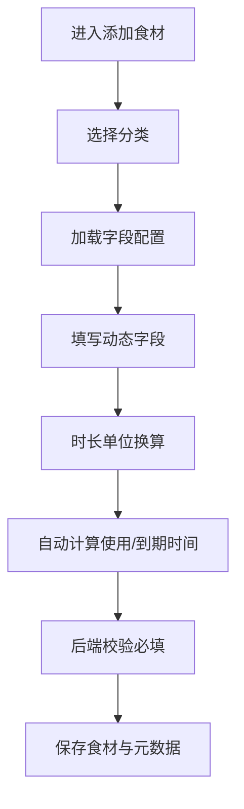
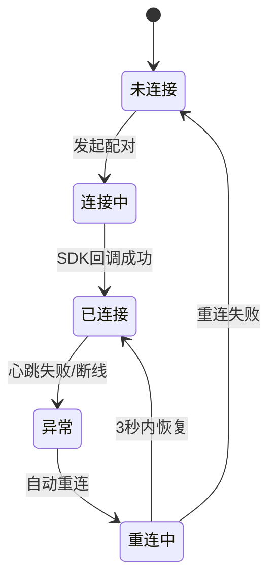

# 食材分类与打印系统重构 PRD

## 1. 目标
- 统一食材添加流程为“单一分类驱动动态字段”。
- 建立全局打印状态源，消除页面间连接状态不一致。
- 提供可视化模板编辑器，支持拖拽排版、图片框、实时预览。

## 2. 关键流程图

## 3. 字段配置表
| 字段键 | 字段名称 | 类型 | 必填 | 说明 |
|---|---|---|---|---|
| name | 名称 | text | 是 | 食材主键展示 |
| thawTime | 解冻时间 | duration | 是 | 支持分钟/小时/天/月/年/自定义 |
| preserveTime | 保存时间 | duration | 是 | 支持分钟/小时/天/月/年/自定义 |
| useTime | 使用时间 | computedTime | 否 | thawTime 自动换算 |
| expTime | 到期时间 | computedTime | 否 | useTime + preserveTime |
| operatorName | 制作人员 | text | 否 | 标签可选字段 |
| storageCondition | 贮存条件 | text | 否 | 标签可选字段 |
| stock | 库存 | number | 否 | 未填不参与打印 |
| unit | 单位 | text | 否 | 未填不参与打印 |

## 4. 交互与约束
- 分类入口唯一化，仅保留分类选择器。
- 时间字段只读展示“使用时间/到期时间”，不可手改。
- 模板编辑不暴露手输占位符，通过字段素材按钮加入。
- 打印入口共用全局状态，状态变化广播到所有页面。

## 5. 验收指标
- 时长换算覆盖边界值与夏令时场景。
- 打印状态延迟目标：心跳 2 秒，重连触发后 3 秒内恢复。
- 模板编辑器支持文本块拖拽、图片框拖拽、字体工具栏。
